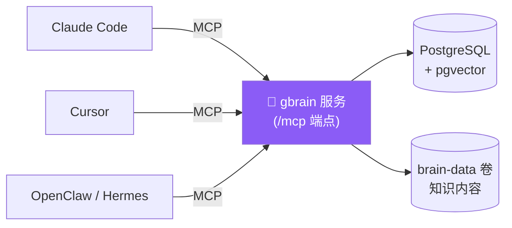

<div align="center">

# 🧠 gbrain-deploy

**一条命令,把 [gbrain](https://github.com/garrytan/gbrain) 部署成所有 AI agent 共享的「知识大脑」**

让 Claude、Cursor、OpenClaw、Hermes…… 连到同一个大脑,记忆不再各存各的。

[](#-license)
[](https://docs.docker.com/compose/)
[](gbrain.sh)
[](https://github.com/garrytan/gbrain)

[⚡ 快速开始](#-快速开始) · [🌐 暴露模式](#-网络暴露模式) · [🔌 接入 Agent](#-接入-agent) · [🔧 日常管理](#-日常管理) · [❓ 常见问题](#-常见问题)

</div>

---

## 这是什么

[gbrain](https://github.com/garrytan/gbrain) 是 Y Combinator 的 Garry Tan 做的个人/团队 AI 知识大脑。

**痛点:** 你有一堆 AI agent —— Claude Code 写代码、Cursor 改文件、别的 agent 跑自动化 —— 但它们各记各的,换个工具上下文就丢了。

**gbrain-deploy 做的事:** 在一台服务器上自托管 gbrain,把它暴露成一个 **MCP 服务**。所有 agent 连到同一个地址,就共享同一份会随时间增长的记忆 —— 谁存的知识,大家都能搜到、用到。



一条命令部署,自动起好 gbrain + PostgreSQL,公网模式还会自动配好 HTTPS。

---

## ✨ 特性

| | |
|---|---|
| 🚀 **一条命令部署** | 交互式向导问几个问题,自动起好全部容器 |
| 🌐 **公网即安全** | `public` 模式内置 Caddy + Let's Encrypt 自动 HTTPS |
| 🔗 **私网/Tailscale** | `private` 模式靠 WireGuard 加密走纯 HTTP,零证书烦恼 |
| 🔑 **每个 agent 独立 token** | 用上游 `gbrain auth` 签发,可单独吊销 —— 不再共享一把密钥 |
| 💾 **加密备份 + 轮转** | 一键产出 AES-256 加密包,自动保留最近 N 份 |
| 🧩 **模型随你选** | 任意 OpenAI 兼容 LLM,词向量可用云端或本地 Ollama(免费) |
| 🐳 **纯 Docker** | 没有系统级残留,`docker compose down` 即净卸 |

---

## ⚡ 快速开始

> 前置:一台装了 **Docker + Docker Compose v2** 的机器。

```bash
git clone https://github.com/wangshub/gbrain-deploy.git
cd gbrain-deploy
./gbrain.sh deploy
```

按提示回答几个问题(数据库、AI 模型、词向量、暴露方式),向导会自动构建并启动。完成后注册你的第一个 agent:

```bash
./gbrain.sh agents add claude-code
```

它会打印一个 **只显示一次** 的 `gbrain_...` token 和 MCP 端点 —— 把它填进 agent 的 MCP 配置即可。详细接入见 **[AGENT.md](AGENT.md)**。

---

## 🌐 网络暴露模式

部署时会让你二选一(写入 `.env` 的 `EXPOSE_MODE`):

| | 🌍 `public` | 🔒 `private` |
|---|---|---|
| **适合** | 有公网域名的云服务器 | Tailscale / 内网 / 本地开发 |
| **HTTPS** | 自动(Let's Encrypt + Caddy) | 走内网/VPN 加密,或 `tailscale serve` |
| **需要准备** | 域名 + ACME 邮箱 | 无 |
| **MCP 端点** | `https://<域名>/mcp` | `http://<bind-addr>:<port>/mcp` |
| **管理后台** | `https://<域名>/admin` | `http://<bind-addr>:<port>/admin` |

<details>
<summary><b>这两种模式分别怎么工作?</b></summary>

- **public** —— 启用 Caddy 的 compose profile,Caddy 监听 80/443 反代到 gbrain,自动申请并续期 Let's Encrypt 证书。gbrain 本身不对外暴露端口,只在内网。你只需填 `DOMAIN` 和 `ACME_EMAIL`。
- **private** —— 不启 Caddy。gbrain 端口绑定到 `GBRAIN_BIND_ADDR`(默认 `127.0.0.1`;Tailscale 场景填你的 tailnet IP `100.x.x.x`),靠 WireGuard/内网本身的加密走纯 HTTP。需要 HTTPS + MagicDNS 时,在宿主机自行运行一次:

  ```bash
  tailscale serve --bg https / http://localhost:<port>
  ```

</details>

---

## 🧭 部署向导会问什么

<details>
<summary><b>展开:逐步问答示例</b></summary>

#### 1. 数据库

```text
PostgreSQL 用户 [gbrain]:
PostgreSQL 密码 [自动生成]:   ← 回车即可,自动生成强密码
PostgreSQL 数据库名 [gbrain]:
```

#### 2. AI 模型(用于知识提取、摘要、纠错)

```text
LLM 提供商:
  1) OpenAI
  2) 自定义地址(任意 OpenAI 兼容:中转站 / One API / LiteLLM……)
  3) 跳过,之后再说
```

选 2 可填任意 OpenAI 兼容地址:

```text
API 地址: https://your-api.com/v1
API Key:  sk-xxx
模型名:    gpt-4o
```

#### 3. 词向量模型(用于搜索)

```text
词向量提供商:
  1) OpenAI      2) 自定义地址(OpenAI 兼容)
  3) ZeroEntropy 4) Voyage AI
  5) Ollama(本地运行,免费,无需 API Key)
  6) 跳过
```

选 Ollama 完全本地、免费,脚本会提示先拉模型:`ollama pull nomic-embed-text`。

#### 4. 网络暴露模式

```text
暴露模式:
  1) public  — 公网域名 + Caddy 自动 HTTPS
  2) private — 内网/Tailscale(纯 HTTP,绑定指定地址)
```

`public` 还需填域名与 ACME 邮箱;`private` 还需填绑定地址(默认 `127.0.0.1`,Tailscale 填 `100.x.x.x`)。

#### 5. 服务端口和管理密码

```text
HTTP 端口 [3000]:
管理密码 [自动生成]:   ← 回车自动生成
```

#### 6. 确认

显示配置汇总,确认后自动构建并启动。

</details>

---

## 🔌 接入 Agent

```bash
# 注册一个 agent,拿到连接凭证(gbrain_... token,只显示一次)
./gbrain.sh agents add claude-code

# 查看已注册的 agents
./gbrain.sh agents list

# 吊销并移除
./gbrain.sh agents remove claude-code
```

凭证保存在 `credentials/<name>.json`。各平台(Claude Code、Cursor……)的具体 MCP 配置写法、对话示例,看 **[AGENT.md](AGENT.md)**。

<details>
<summary><b>跑起来是什么体验?</b></summary>

部署后,agent 能直接读写你的知识库。以 Claude Code 为例:

```text
你: 帮我查一下之前和 Bob 讨论过的项目方案
Claude Code: [gbrain search] 找到 3 条:
  1. "和 Bob 讨论 Acme 项目架构" — 选了微服务方案…
  2. "Acme 项目技术选型" — 数据库用 PostgreSQL…

你: 记一下:明天下午 3 点和 Alice 开会,讨论 Q2 预算
Claude Code: [gbrain capture] 已保存。

你: Bob 投资了哪些公司?
Claude Code: [gbrain graph-query]
  - Acme AI(种子轮,2024-01)
  - Beta Corp(A 轮,2024-03)
```

</details>

---

## 🔧 日常管理

```bash
./gbrain.sh status              # 服务状态 + 端点
./gbrain.sh logs -f             # 跟踪日志
./gbrain.sh restart             # 重启
./gbrain.sh stop / start        # 停止 / 启动
./gbrain.sh config view         # 查看配置(敏感值自动打码)
./gbrain.sh config set GBRAIN_PORT 3001 && ./gbrain.sh restart
```

<details>
<summary><b>直接操作 Docker(高级)</b></summary>

```bash
docker compose ps
docker compose logs -f gbrain
docker compose restart gbrain
docker compose down            # 停止全部
docker compose up -d           # 启动全部
```

</details>

---

## 💾 备份与迁移

```bash
# 备份:生成 AES-256 加密的 .tar.enc(口令取自 .env 的 BACKUP_PASSPHRASE)
./gbrain.sh backup
# 默认保留最近 7 份(BACKUP_KEEP),自动轮转

# 恢复:需要相同的 BACKUP_PASSPHRASE
./gbrain.sh restore backups/gbrain-<timestamp>.tar.enc
```

> **迁移到新机器:** 备份 → 把 `.tar.enc` 和 `.env` 拷过去 → 在新机 `./gbrain.sh deploy` → `./gbrain.sh restore <文件>`。
> ⚠️ 加密口令 `BACKUP_PASSPHRASE` 丢了就解不开备份,请妥善保存。

---

## ❓ 常见问题

<details>
<summary><b>不想用 OpenAI,有国内替代吗?</b></summary>

选「自定义地址」,填你的中转站或私有 API 地址即可 —— 任何 OpenAI 兼容的 API 都行。
</details>

<details>
<summary><b>词向量不想花钱?</b></summary>

选 Ollama,完全本地、免费。先装:`curl -fsSL https://ollama.com/install.sh | sh`,再拉模型:`ollama pull nomic-embed-text`。
</details>

<details>
<summary><b>支持 macOS 吗?</b></summary>

支持 —— 装 Docker Desktop for Mac,按正常 Docker 流程部署即可。
</details>

<details>
<summary><b>中国大陆服务器拉不动 Docker Hub / Debian / npm 怎么办?</b></summary>

在 `.env` 里取消注释「China mirror」一节,用国内镜像源拉镜像与构建依赖(默认仍走上游):

```bash
BUN_IMAGE=docker.m.daocloud.io/oven/bun:1
POSTGRES_IMAGE=docker.m.daocloud.io/pgvector/pgvector:pg16
CADDY_IMAGE=docker.m.daocloud.io/library/caddy:2
APT_MIRROR=mirrors.aliyun.com
NPM_REGISTRY=https://registry.npmmirror.com
```

然后正常 `./gbrain.sh deploy`。镜像源可达性各地不同,可换 `docker.1panel.live` 等。
</details>

<details>
<summary><b>token 泄露 / agent 离职了怎么办?</b></summary>

`./gbrain.sh agents remove <name>` 会调用上游 `gbrain auth revoke` 吊销该 token,其它 agent 不受影响。
</details>

---

## 📁 项目结构

<details>
<summary><b>展开目录树</b></summary>

```text
gbrain-deploy/
├── gbrain.sh              ← 统一 CLI 入口(推荐用法)
├── lib/common.sh          ← 共享函数库
├── cmd/                   ← 各子命令实现
│   ├── deploy.sh          ← 部署向导
│   ├── status.sh  logs.sh  service.sh
│   ├── agents.sh          ← Agent 注册/吊销
│   ├── backup.sh  restore.sh
│   ├── config.sh  test.sh
├── scripts/entrypoint.sh  ← Docker 容器启动脚本
├── docker-compose.yml     ← 服务编排(postgres / gbrain / caddy / ollama)
├── Caddyfile              ← 公网模式反代 + 自动 HTTPS
├── Dockerfile             ← gbrain 容器镜像
├── .env.example           ← 配置模板
└── AGENT.md               ← Agent 接入指南
```

</details>

---

## 📜 License

MIT。上游 [gbrain](https://github.com/garrytan/gbrain) 同为 MIT,由 Garry Tan 开发。

<div align="center"><sub>用 <code>./gbrain.sh deploy</code> 给你的 agent 们一个共享的大脑 🧠</sub></div>
